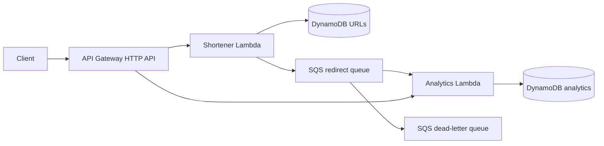

# Serverless URL Shortener

A small AWS-native URL shortener with asynchronous, idempotent redirect analytics.

## Architecture



The project intentionally uses one deployment model: Go custom-runtime Lambda ZIPs. There are no long-running HTTP containers, VPC resources, relational database, or cache cluster to operate.

### Safety properties

- Short IDs are deterministic 96-bit URL-safe SHA-256 prefixes and expand automatically on a collision.
- DynamoDB condition expressions prevent one URL from overwriting another.
- Redirect analytics use SQS partial-batch failure reporting.
- An SQS message ID is retained for 15 days and recorded in the same DynamoDB transaction as both counters, making retries idempotent across the DLQ retention window.
- SQS and DynamoDB are encrypted at rest. Production tables enable deletion protection and point-in-time recovery.
- API Gateway throttling, a DLQ alarm, Lambda error alarms, request-size limits, strict JSON decoding, and least-privilege IAM are included.

## Repository layout

```text
cmd/                 Lambda entry points
internal/shortener/  URL API, DynamoDB store, SQS publisher
internal/analytics/  stats API, idempotent DynamoDB counters
infra_tf/            AWS infrastructure
design/              request and storage design notes
tests/e2e/           deployed-platform journey test
jenkins/             optional local Jenkins bootstrap
```

## API

| Method | Path | Purpose |
| --- | --- | --- |
| `GET` | `/health` | Shortener liveness |
| `GET` | `/ready` | Shortener DynamoDB readiness |
| `POST` | `/api/v1/shorten` | Create or return a stable short URL |
| `GET` | `/api/v1/urls/{shortURL}` | Retrieve URL metadata |
| `GET` | `/r/{shortURL}` | Redirect and enqueue analytics |
| `GET` | `/api/v1/analytics/stats` | Read redirect counters |

Example request:

```bash
curl -X POST "$API_ENDPOINT/api/v1/shorten" \
  -H 'Content-Type: application/json' \
  -d '{"long_url":"https://example.com/article"}'
```

## Development

Go 1.26.6 or newer is required.

```bash
go test ./...
go vet ./...
gofmt -w cmd internal tests
```

The normal unit suite does not require AWS. The end-to-end suite targets a deployed gateway:

```bash
GATEWAY_URL=https://example.execute-api.us-east-1.amazonaws.com \
  go test -tags=e2e -count=1 ./tests/e2e/ -v
```

## Deployment

1. Create a versioned S3 bucket for Terraform state.
2. Copy `infra_tf/backend.hcl.example` to the ignored `infra_tf/backend.hcl` and set a unique key per environment.
3. Copy `infra_tf/terraform.tfvars.example` to the ignored `infra_tf/terraform.tfvars`.
4. Build both ARM64 Lambda packages.
5. Review a saved plan before applying it.

```bash
mkdir -p bin
CGO_ENABLED=0 GOOS=linux GOARCH=arm64 go build -trimpath -ldflags="-s -w" -o bootstrap ./cmd/shortener
zip -j bin/shortener.zip bootstrap
CGO_ENABLED=0 GOOS=linux GOARCH=arm64 go build -trimpath -ldflags="-s -w" -o bootstrap ./cmd/analytics
zip -j bin/analytics.zip bootstrap
rm bootstrap

terraform -chdir=infra_tf init -reconfigure -backend-config=backend.hcl
terraform -chdir=infra_tf plan -out=tfplan
terraform -chdir=infra_tf apply tfplan
```

The Jenkins job performs quality checks, tests, packaging, and Terraform validation on every run. AWS planning is opt-in. Applying a saved plan requires the `DEPLOY` parameter and an explicit approval. CI should authenticate with an IAM role; `aws_profile` exists only for local use.

Set `alarm_topic_arn` in `terraform.tfvars` if CloudWatch alarms should notify an existing SNS operations topic.

For local Jenkins, set `AWS_CONFIG_DIR` to the host directory containing your AWS configuration before running `docker compose -f docker-compose.jenkins.yml up --build`. Jenkins listens only on `127.0.0.1:8080`; complete the normal first-run administrator setup instead of disabling authentication.

## Environment variables

| Lambda | Variable | Required | Meaning |
| --- | --- | --- | --- |
| Shortener | `URLS_TABLE` | Yes | URL DynamoDB table |
| Shortener | `SQS_QUEUE_URL` | In AWS | Redirect event queue; omission disables analytics publishing |
| Analytics | `ANALYTICS_TABLE` | Yes | Analytics DynamoDB table |
| Analytics | `DEDUPE_TTL_SECONDS` | No | Event dedupe retention; default 15 days, allowed range 14–30 days |

## Operations and limitations

- The public creation endpoint is rate-limited but unauthenticated. Add an API Gateway authorizer before offering private or paid accounts.
- Analytics returns all per-URL counters and therefore suits a reference or modest dataset. A paginated endpoint should replace it at large scale.
- SQS publishing is performed before the redirect response and has a 1.5-second timeout. A redirect still succeeds if analytics publishing fails; the failure is logged and observable through application logs.
- Exact AWS pricing and Lambda memory should be optimized from CloudWatch measurements rather than assumed in code.

See [MIGRATION.md](MIGRATION.md) before replacing an existing PostgreSQL/Redis deployment.
