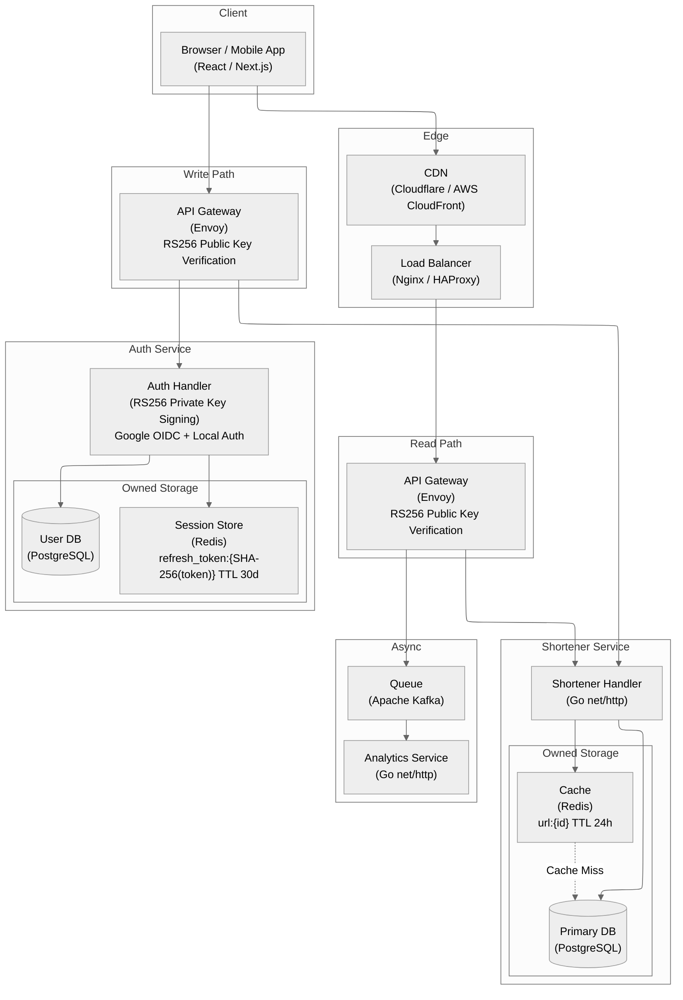
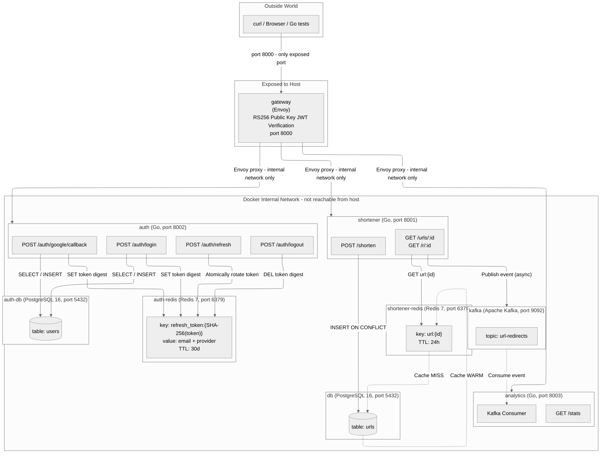

# Microservice Authentication Platform

> Production-oriented reference platform for identity, session management, protected URL shortening, and event-driven analytics using decoupled services.


---

## 1. Core Purpose & Business Value

This platform delivers a complete user identity and session management foundation, enabling product teams to ship authenticated features faster while giving security teams full control over who accesses what — and for how long.

- **Frictionless Onboarding & Social Sign-in**: Users can register or sign in using their existing Google accounts with a single click, dramatically reducing sign-up abandonment and increasing conversion rates for consumer-facing products.
- **Session Revocation with a Bounded Access Window**: Refresh sessions can be revoked immediately; already-issued access tokens remain valid only for their configured short lifetime (15 minutes by default).
- **Zero-Trust Feature Protection**: Every product feature behind authentication is protected by a cryptographically verifiable identity check that requires no additional server calls per request, enabling sub-millisecond access decisions at scale without sacrificing security.
- **Unified Identity Across Sign-in Providers**: Whether a user registers via email/password or Google, the platform issues a single, consistent identity token accepted by all internal services — eliminating fragmented user records and duplicate account issues.
- **Stateless Horizontal Scalability**: The access verification layer operates entirely without shared state between server instances, allowing the product to scale to any number of concurrent users without bottlenecks in the authentication path.

---

## 2. System Architecture & Technical Execution

The platform separates the identity issuance concern (Auth Service) from the verification concern (API Gateway), enabling stateless horizontal scaling of the request path while centralizing all credential management in a single, auditable service.

### High-Level Target Production Architecture Diagram



### Container Network & Isolation Design Diagram



---

## 3. Repository Structure

```text
Microservice-Auth-Platform/
├── cmd/              # Service entry points
│   ├── analytics/
│   ├── auth/
│   └── shortener/
├── internal/         # Go service implementations and unit tests
│   ├── analytics/    # Kafka consumer and in-memory counters
│   ├── auth/         # JWT, OIDC, bcrypt, PostgreSQL, and Redis
│   └── shortener/    # PostgreSQL, Redis cache, redirects, and Kafka producer
├── services/         # Multi-stage Dockerfiles for the three Go binaries
├── infra_tf/         # Kubernetes infrastructure as Terraform
├── design/           # Architecture and API design documents
├── tests/e2e/        # Go end-to-end tests (build tag: e2e)
├── go.mod
└── go.sum
```

## 4. Build and Test

Go 1.26 or newer is required.

```bash
go test ./...
go build ./cmd/...
```

Run the end-to-end suite against a deployed gateway with:

```bash
GATEWAY_URL=http://localhost:8000 go test -tags=e2e ./tests/e2e/ -v
```

To include the mock Google flow, deploy with `allow_mock_oidc = true`, use a `mock-*` client ID, and set `RUN_MOCK_OIDC_E2E=true` for the test command.

## 5. Security and Deployment Notes

- The Auth service requires an RSA PKCS#8 private key through `JWT_PRIVATE_KEY` or `RSA_PRIVATE_KEY_PEM`; no development signing key is embedded in the binary.
- Envoy obtains the matching public key from the Auth service's JWKS endpoint and caches it for JWT verification.
- Envoy applies a bounded local token-bucket rate limit before JWT processing; production multi-replica deployments should use a shared global rate-limit service at the edge.
- Real Google ID tokens are verified for their RSA signature, issuer, audience, expiry, authorized party, and verified email. Mock OIDC additionally requires `ALLOW_MOCK_OIDC=true` and a `mock-*` Google client ID.
- Refresh tokens are 48 random bytes, stored only by SHA-256 digest, rotated after every refresh, and delivered in an `HttpOnly`, `SameSite=Lax` cookie. Set `cookie_secure = true` for HTTPS deployments.
- `infra_tf/kafka.tf` provides a single-node Kafka broker for local/test clusters. Use a managed or multi-node Kafka installation in production.

Create `infra_tf/terraform.tfvars` from the example, supply strong database passwords and an RSA private key, then run the scripts in `CICD_script/` in numerical order.
