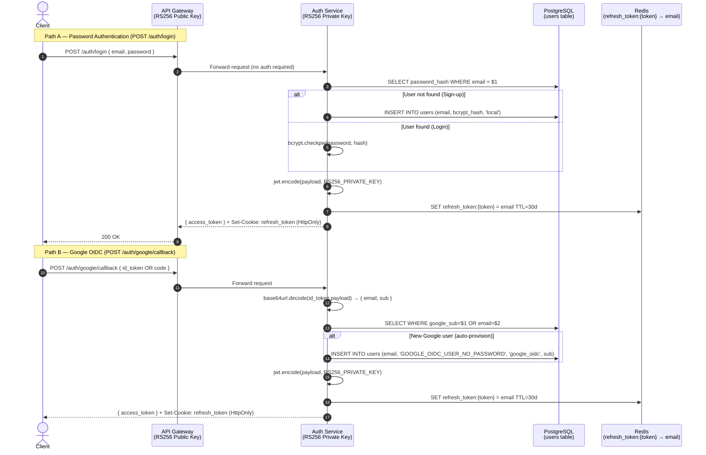
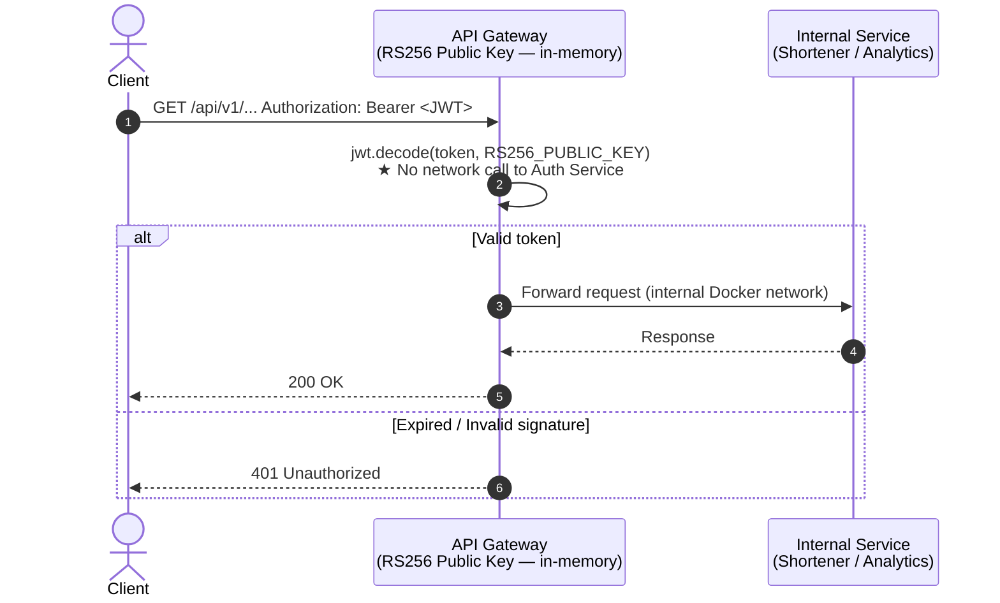
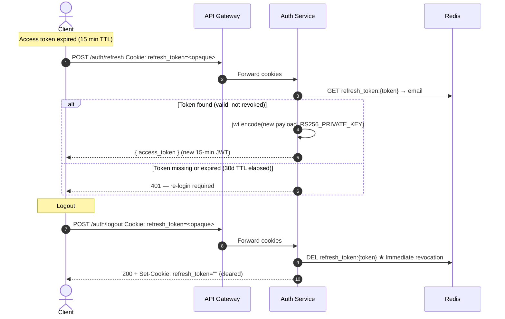
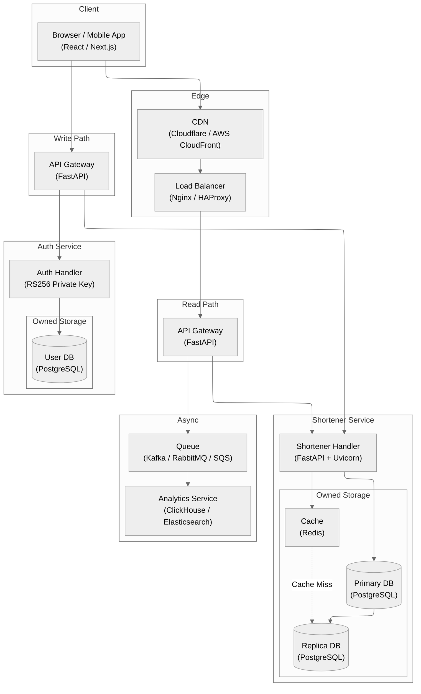
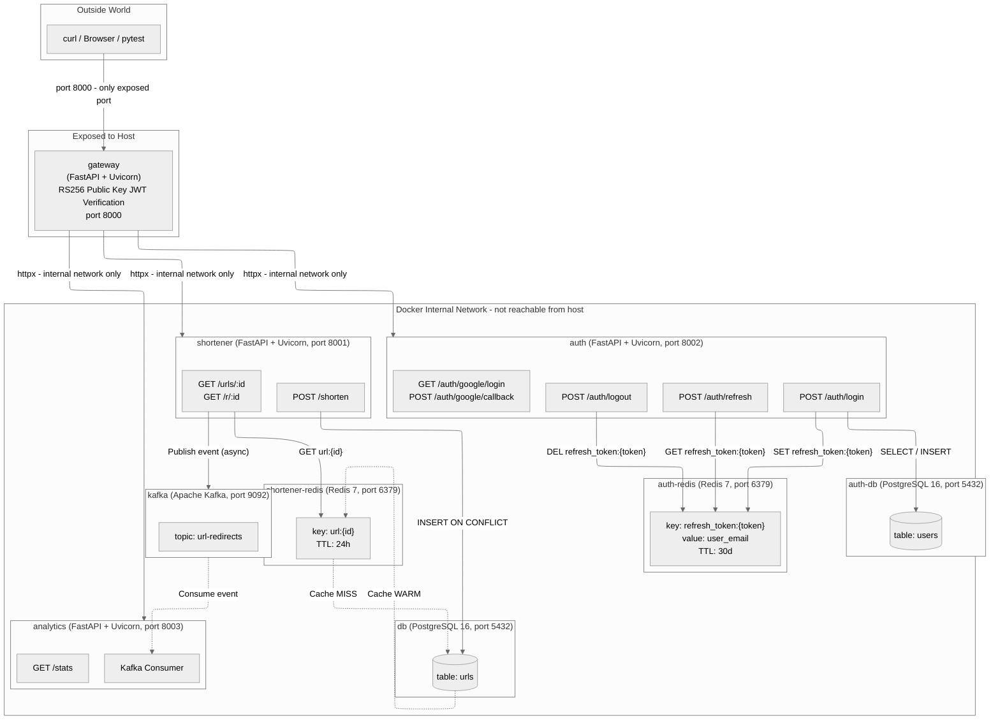

# Microservice Authentication Platform

> Production-grade authentication microservice implementing JWT RS256 asymmetric signing, Google OpenID Connect (OIDC), Redis-backed refresh token rotation, and bcrypt password hashing — deployed as an isolated Docker container behind an API Gateway with zero-trust local token verification.


---

## 1. Authentication Architecture & Design Decisions

This platform implements a **dual authentication strategy** — local password auth and Google OIDC — unified under a single RS256 JWT schema. The key design decisions are documented below.

### Why RS256 (Asymmetric) Instead of HS256 (Symmetric)?

| Aspect | RS256 (this project) | HS256 |
|--------|----------------------|-------|
| Key type | RSA private + public key pair | Single shared secret |
| Token issuer | Signs with private key (Auth Service only) | Any party with the secret can sign |
| Token verifier | Verifies with public key (Gateway, any service) | Must share the same secret |
| Security boundary | Private key never leaves Auth container | Secret must be distributed to all verifiers |
| **Use case** | **Microservices, federated identity** | Single-service monolith |

> **In this project**: The API Gateway verifies every incoming JWT **locally** using the RS256 public key — zero network round-trips to the Auth Service per request. This is the same model used by Google, Auth0, and AWS Cognito.

### Auth Flow: Login / Sign-up (Dual-Provider)



### Auth Flow: Protected Request Verification (Zero-Trust Gateway)



### Auth Flow: Refresh Token Rotation



---

## 2. Auth Service Implementation

### Core Modules

| Module | Responsibility |
|--------|---------------|
| `services/auth/main.py` | FastAPI app — login, refresh, logout, Google OIDC endpoints |
| `services/auth/tokens.py` | `create_access_token()` (RS256 JWT), `generate_refresh_token()` (opaque), Redis store/get/delete |
| `services/auth/passwords.py` | `hash_password()` (bcrypt), `verify_password()` (bcrypt.checkpw) |
| `services/auth/oidc.py` | `build_google_auth_url()`, `exchange_code_for_id_token()`, `parse_google_id_token()` |
| `services/auth/database.py` | asyncpg connection pool, `init_users_table()` (auto-migration) |
| `services/auth/config.py` | ENV-driven config: RSA keys, Redis URL, OIDC credentials, TTL constants |
| `services/gateway/main.py` | `verify_token()` — pure in-memory RS256 public key JWT decode (no auth service call) |

### JWT Payload Schema

```json
{
  "sub": "user@example.com",
  "email": "user@example.com",
  "sso_provider": "local | google_oidc",
  "iat": 1700000000,
  "exp": 1700000900
}
```

### PostgreSQL `users` Table Schema

```sql
CREATE TABLE IF NOT EXISTS users (
    email         VARCHAR(255) PRIMARY KEY,
    password_hash VARCHAR(255) NOT NULL,
    sso_provider  VARCHAR(50)  DEFAULT 'local',
    google_sub    VARCHAR(255),
    created_at    TIMESTAMPTZ  DEFAULT NOW()
);
```

### Redis Refresh Token Schema

```
Key:   refresh_token:{64-byte-urlsafe-random-token}
Value: user@example.com
TTL:   2,592,000 seconds (30 days)
```

---

## 3. System Architecture

### High-Level Target Production Architecture Diagram



### Container Network & Isolation Design Diagram



---

## 4. Repository Structure

```text
Microservice-Auth-Platform/
├── .agents/          # Workspace configuration and guidelines
├── design/           # Architecture diagrams and design specifications
│   ├── analytics/    # Analytics service design documentation
│   ├── auth/         # Authentication service design documentation
│   └── shortener/    # Shortener service design documentation
├── infra_tf/         # Infrastructure as Code (Terraform)
│   ├── apps.tf       # Application workloads deployment
│   ├── dbs.tf        # Databases & cache cluster setup
│   ├── main.tf       # Terraform provider configuration
│   ├── outputs.tf    # Infrastructure output definitions
│   └── variables.tf  # Environment variable declarations
├── keys/             # RSA public/private keys for JWT verification
├── scripts/          # Automation build and deployment scripts
│   ├── 01_build_images.sh
│   ├── 02_deploy_tf.sh
│   ├── 03_run_tests.sh
│   └── run_test_k8s.sh
├── services/         # Decoupled microservices architecture
│   ├── analytics/    # Real-time click tracking & aggregation
│   ├── auth/         # ★ JWT auth, Google OIDC & user management (core)
│   ├── gateway/      # Reverse proxy & zero-trust RS256 JWT verification
│   └── shortener/    # URL encoding, decoding & cache layer
├── tests/            # Automated test suites
│   ├── e2e/          # End-to-end user journey tests
│   ├── integration/  # Inter-service integration tests (Redis token store)
│   └── unit/         # Unit tests — bcrypt, RS256 JWT, Google OIDC
├── .dockerignore
├── .gitignore
├── pyproject.toml    # Dependency management & pytest config
└── uv.lock           # Locked dependency lockfile
```

---

## 5. Running Tests

```bash
# Unit tests (offline — no Docker required)
uv run pytest tests/unit/ -v

# Integration tests (requires Redis)
uv run pytest tests/integration/ -v

# E2E tests (requires full Docker stack)
docker compose up -d
uv run pytest tests/e2e/ -v
```
