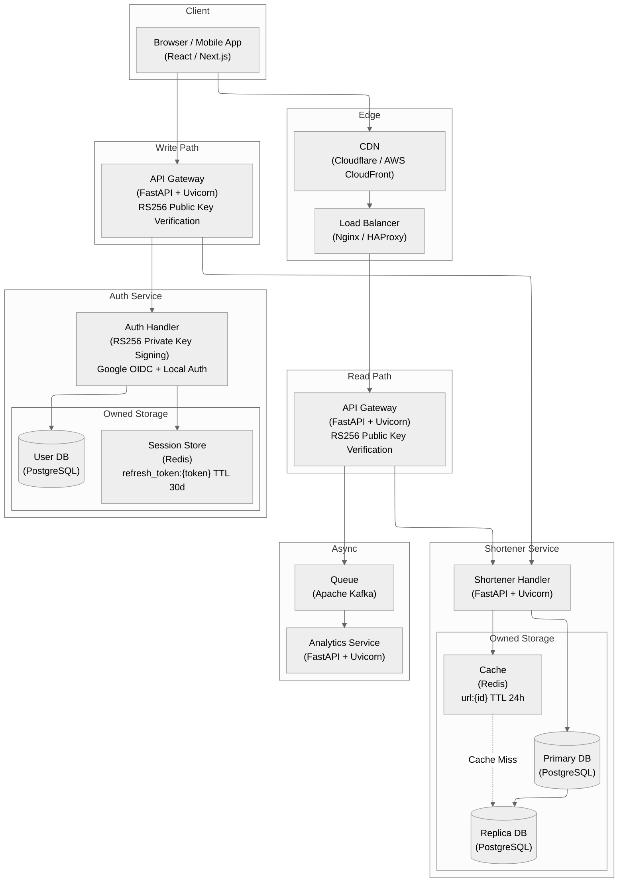
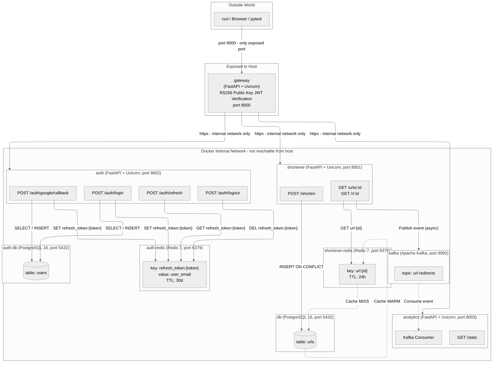

# Microservice Authentication Platform

> Enterprise-grade identity and access control platform built on a decoupled microservice architecture — enabling organizations to secure product features, unify user identities across sign-in providers, and maintain complete session lifecycle control.


---

## 1. Core Purpose & Business Value

This platform delivers a complete user identity and session management foundation, enabling product teams to ship authenticated features faster while giving security teams full control over who accesses what — and for how long.

- **Frictionless Onboarding & Social Sign-in**: Users can register or sign in using their existing Google accounts with a single click, dramatically reducing sign-up abandonment and increasing conversion rates for consumer-facing products.
- **Enterprise Account Control & Immediate Access Revocation**: Security teams can instantly invalidate any user session organization-wide — critical for offboarding employees, responding to suspicious activity, or enforcing compliance policies — without requiring users to wait for natural token expiration.
- **Zero-Trust Feature Protection**: Every product feature behind authentication is protected by a cryptographically verifiable identity check that requires no additional server calls per request, enabling sub-millisecond access decisions at scale without sacrificing security.
- **Unified Identity Across Sign-in Providers**: Whether a user registers via email/password or Google, the platform issues a single, consistent identity token accepted by all internal services — eliminating fragmented user records and duplicate account issues.
- **Stateless Horizontal Scalability**: The access verification layer operates entirely without shared state between server instances, allowing the product to scale to any number of concurrent users without bottlenecks in the authentication path.

---

## 2. System Architecture & Technical Execution

The platform separates the identity issuance concern (Auth Service) from the verification concern (API Gateway), enabling stateless horizontal scaling of the request path while centralizing all credential management in a single, auditable service.

### High-Level Target Production Architecture Diagram



### Container Network & Isolation Design Diagram



---

## 3. Repository Structure

```text
Microservice-Auth-Platform/
├── design/           # Architecture diagrams and design specifications
│   ├── analytics/    # Analytics service design documentation
│   ├── auth/         # Authentication service design documentation
│   └── shortener/    # Shortener service design documentation
├── infra_tf/         # Infrastructure as Code (Terraform)
│   ├── apps.tf       # Application workloads deployment
│   ├── dbs.tf        # Databases & cache cluster setup
│   ├── main.tf       # Terraform provider configuration
│   ├── outputs.tf    # Infrastructure output definitions
│   └── variables.tf  # Environment variable declarations
├── scripts/          # Automation build and deployment scripts
│   ├── 01_build_images.sh
│   ├── 02_deploy_tf.sh
│   ├── 03_run_tests.sh
│   └── run_test_k8s.sh
├── services/         # Decoupled microservices architecture
│   ├── analytics/    # Real-time click tracking & aggregation (Kafka consumer)
│   ├── auth/         # Identity issuance — JWT RS256, Google OIDC, session lifecycle
│   │   ├── config.py     # ENV-driven config: RSA keys, Redis URL, OIDC credentials
│   │   ├── database.py   # asyncpg connection pool & auto-migration
│   │   ├── main.py       # FastAPI app — login, refresh, logout, Google OIDC
│   │   ├── oidc.py       # Google OAuth2 URL builder, ID token parser & mock fixtures
│   │   ├── passwords.py  # bcrypt hash & verify
│   │   ├── schemas.py    # Pydantic request/response models
│   │   └── tokens.py     # RS256 JWT creation, opaque refresh token, Redis store
│   ├── gateway/      # Reverse proxy — RS256 public key verification (zero network call)
│   └── shortener/    # URL encoding, decoding & Redis cache-aside layer
├── tests/            # Automated test suites
│   ├── e2e/          # End-to-end user journey tests (full Docker stack)
│   ├── integration/  # Inter-service integration tests (Redis token store)
│   └── unit/         # Unit tests — bcrypt, RS256 JWT, Google OIDC token parsing
├── .dockerignore
├── .gitignore
├── pyproject.toml    # Dependency management & pytest config
└── uv.lock           # Locked dependency lockfile
```
