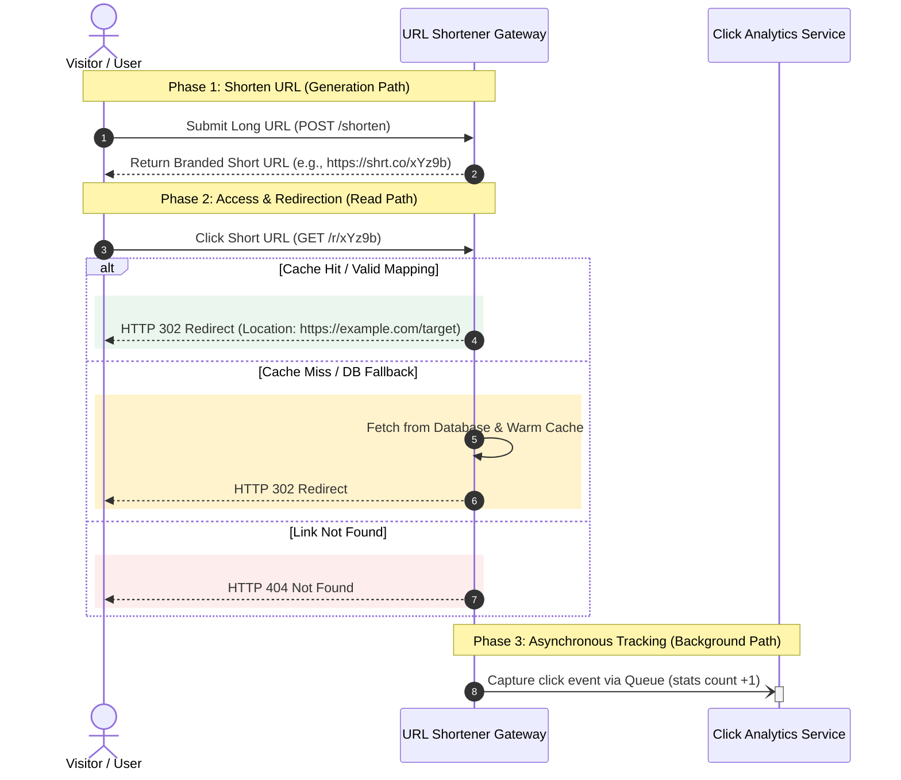
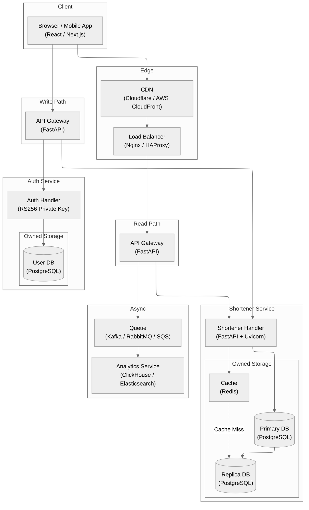
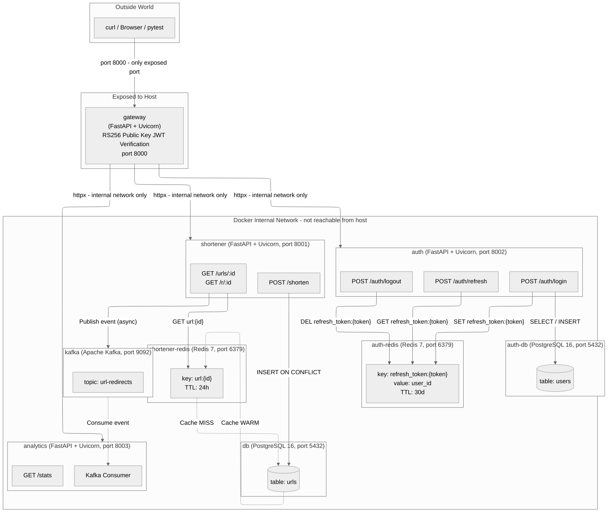

# Enterprise URL Shortener Platform

> High-throughput microservice-based link management and real-time click analytics platform engineered for enterprise brand marketing and instant URL redirection.


---

## 1. Core Purpose & Business Value

Enterprise URL Shortener Platform converts long, complex web links into concise, memorable brand assets while delivering real-time marketing intelligence and sub-millisecond redirection reliability.

- **Brand Recognition & Click-Through Optimization**: Transforms awkward web addresses into clean, trustworthy branded short links, dramatically improving click-through rates across marketing channels.
- **Real-Time Customer Campaign Intelligence**: Captures visitor engagement metrics, geographical reach, and channel performance immediately to optimize ad spend.
- **Enterprise High-Availability SLA**: Guarantees zero-downtime redirection performance for high-volume customer traffic spikes and seasonal promotions.
- **Security & Account Control**: Enforces precise organizational access controls, protecting enterprise links from unauthorized alterations or malicious hijacks.

---

## 2. System Architecture & Technical Execution

### Core Concept & Phased Execution Diagram



### High-Level Target Production Architecture Diagram



### Container Network & Isolation Design Diagram



---

## 3. Repository Structure

```text
URL-Shortener/
├── .agents/          # Workspace configuration and guidelines
├── design/           # Architecture diagrams and design specifications
│   ├── analytics/    # Analytics service design documentation
│   ├── auth/         # Authentication service design documentation
│   └── shortener/    # Shortener service design documentation
├── infra_tf/         # Infrastructure as Code (Terraform)
│   ├── apps.tf       # Application workloads deployment
│   ├── dbs.tf        # Databases & cache cluster setup
│   ├── main.tf       # Terraform provider configuration
│   ├── outputs.tf    # Infrastructure output definitions
│   └── variables.tf  # Environment variable declarations
├── keys/             # RSA public/private keys for JWT verification
├── scripts/          # Automation build and deployment scripts
│   ├── 01_build_images.sh
│   ├── 02_deploy_tf.sh
│   ├── 03_run_tests.sh
│   └── run_test_k8s.sh
├── services/         # Decoupled microservices architecture
│   ├── analytics/    # Real-time click tracking & aggregation
│   ├── auth/         # JWT authentication & user management
│   ├── gateway/      # Reverse proxy & dynamic request router
│   └── shortener/    # URL encoding, decoding & cache layer
├── tests/            # Automated test suites
│   ├── e2e/          # End-to-end user journey tests
│   ├── integration/  # Inter-service integration tests
│   └── unit/         # Unit tests per microservice
├── .dockerignore
├── .gitignore
├── pyproject.toml    # Dependency management & pytest config
└── uv.lock           # Locked dependency lockfile
```
