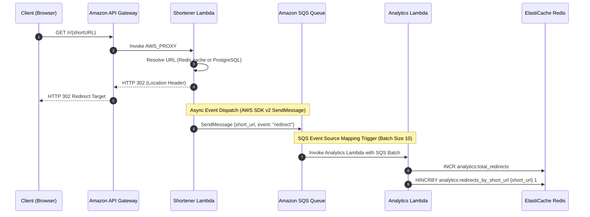
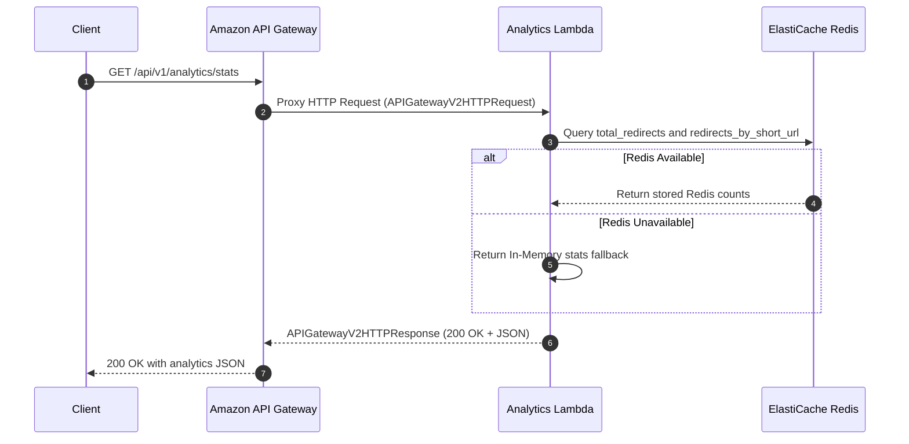

# Analytics Service Design

This document details the design and event-driven architecture of the **Analytics Service** using **Amazon SQS** as the asynchronous message queue and **AWS Lambda** for event-driven serverless processing.

## 1. Redirect Tracking & Event Processing Flow

When a client accesses a shortened link (`GET /r/{short_url}`), the shortener service processes the redirect immediately. It dispatches a message to Amazon SQS asynchronously using the AWS SDK v2, ensuring zero impact on the redirect latency. The Analytics Lambda is triggered by SQS to increment counter metrics in ElastiCache Redis.



---

## 2. Analytics Retrieval Flow

The client retrieves aggregated analytics data via Amazon API Gateway. API Gateway proxies the request directly to the Analytics Lambda function via `AWS_PROXY`.



---

## 3. Data Schema

### SQS Message Payload Structure
The message published on the `url-shortener-redirects-dev` queue is a serialized JSON payload containing the numeric short URL:

```json
{
  "short_url": 42,
  "event": "redirect"
}
```

### Stats API Payload Structure
The HTTP endpoint `GET /api/v1/analytics/stats` (and `GET /stats`) returns a summary of the captured redirect statistics:

```json
{
  "total_redirects": 1,
  "redirects_by_short_url": {
    "42": 1
  }
}
```

### Redis Key Schema
- **Total Redirects Key**: `analytics:total_redirects` (Integer counter, managed via `INCR`)
- **Per-URL Breakdown Key**: `analytics:redirects_by_short_url` (Hash map, field: `{short_url}`, managed via `HINCRBY`)
