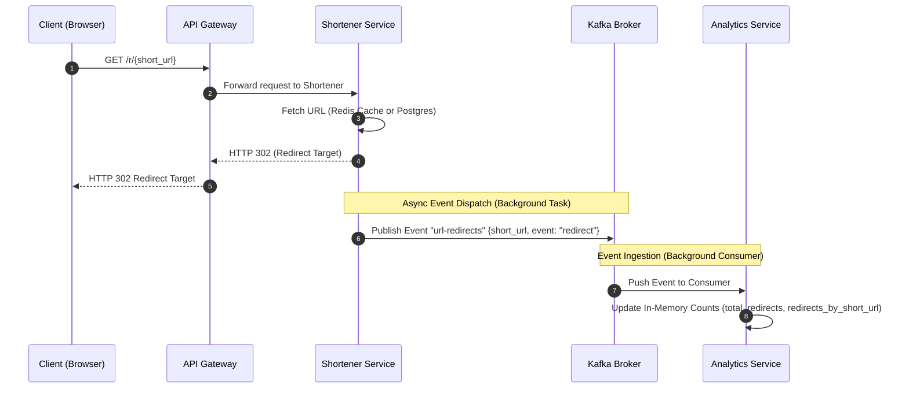
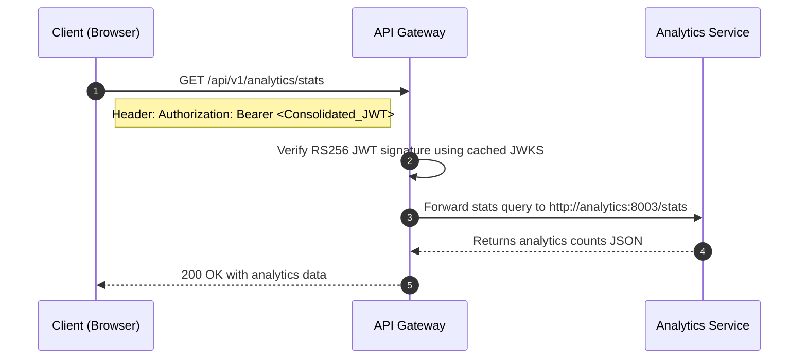

# Analytics Service Design

This document details the design and event-driven architecture of the **Analytics Service** using **Apache Kafka** as the asynchronous message broker.

## 1. Redirect Tracking & Event Processing Flow

When a user accesses a shortened link, the read path processes the redirect immediately. It then publishes an event to Kafka asynchronously to ensure zero impact on the redirect latency.



---

## 2. Analytics Retrieval Flow

The client retrieves analytics data via the API Gateway. The gateway validates the RS256 JWT signature using the Auth service's cached JWKS and proxies the stats request to the analytics container.



---

## 3. Data Schema

### Kafka Event Structure
The message published on the `url-redirects` topic is a serialized JSON payload containing the numeric short URL ID:

```json
{
  "short_url": 42,
  "event": "redirect"
}
```

### Stats API Payload Structure
The HTTP endpoint `/stats` returns a summary of the captured statistics:

```json
{
  "total_redirects": 1,
  "redirects_by_short_url": {
    "42": 1
  }
}
```
