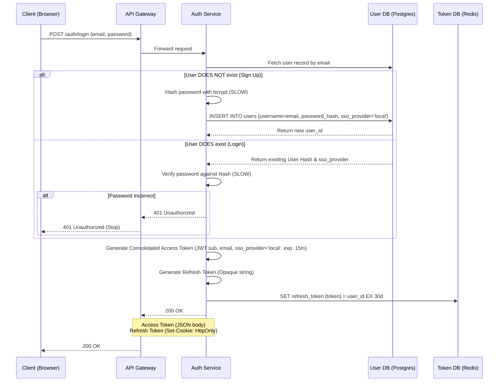
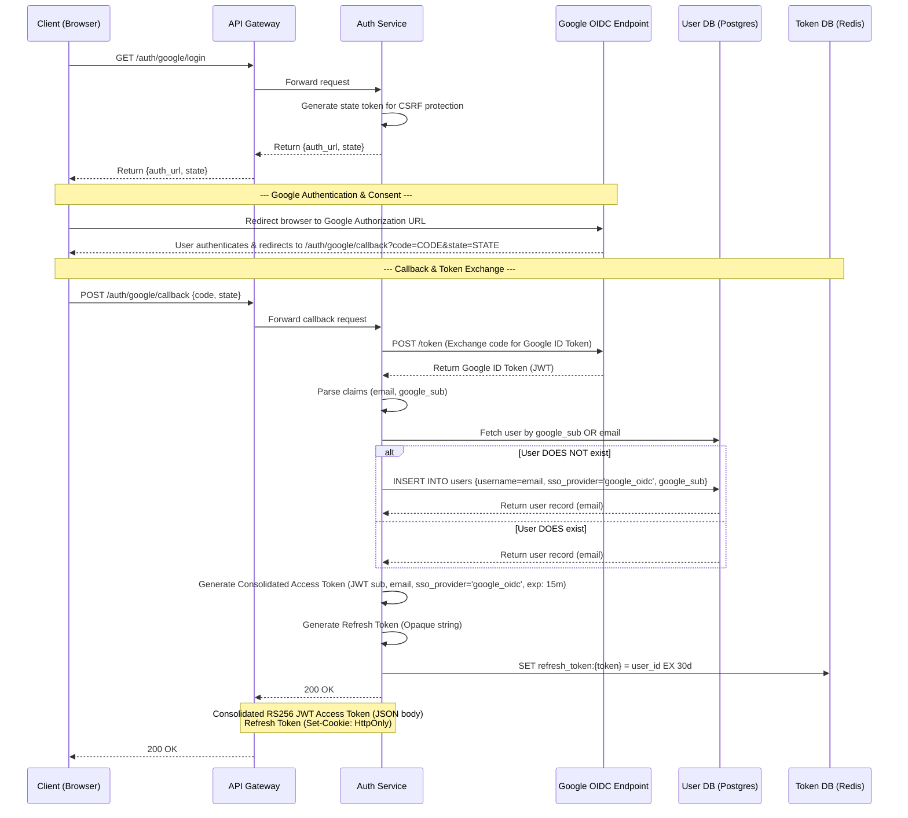
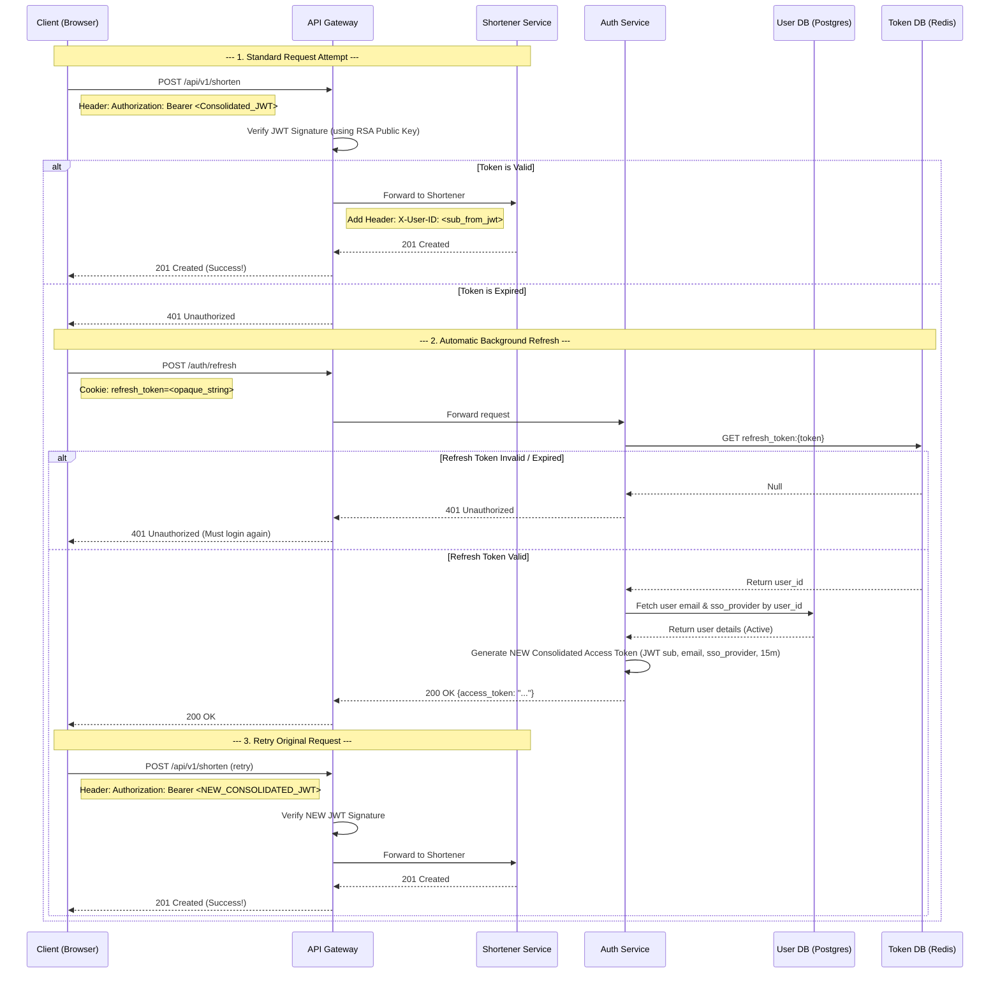
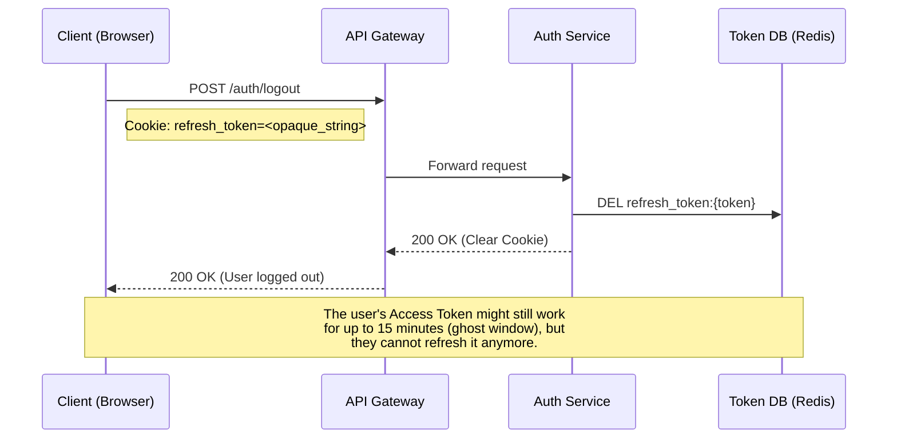

# Auth Service Design

This document details the authentication flows using the **Short-Lived Access Token + Long-Lived Refresh Token** pattern for both Password and Google OIDC authentication.

## 1a. Email Password Sign Up / Login & Token Issuance Flow

---

## 1b. Google OpenID Connect (OIDC) Authorization Code Flow

---

## 2. Standard API Request & Background Refresh Flow

This diagram shows what happens during a standard API request. If the access token is expired, the client automatically handles it by using the refresh token in the background to get a new access token, and then retries the original request.

---

## 3. Logout / Revocation Flow

When the user logs out, we immediately delete the Refresh Token from Redis.

