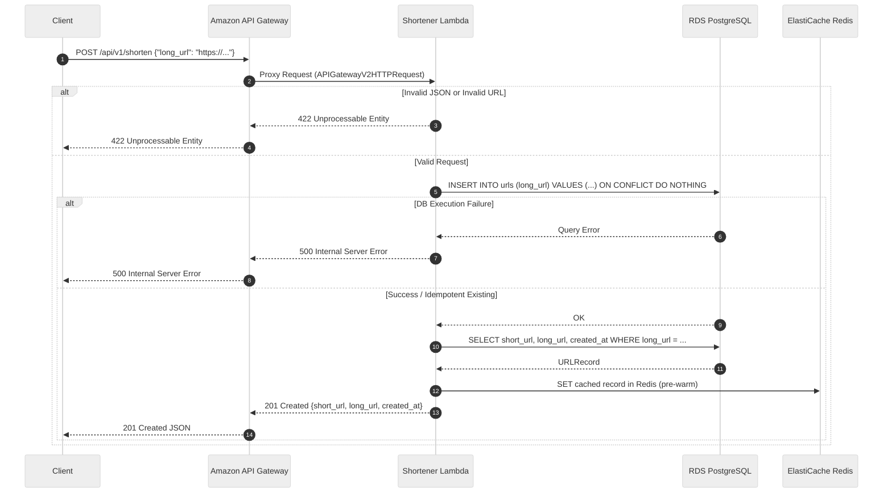

# Write Path API

This document details the write path execution flow for creating shortened URLs via the serverless architecture.

### Request Flow

### Key Technical Details
- **Idempotency**: Handled by PostgreSQL `ON CONFLICT (long_url) DO NOTHING` and `UNIQUE` constraint on `long_url`.
- **Pre-warming**: Immediately after persisting in PostgreSQL, the record is placed into Redis with a 24-hour TTL to ensure sub-millisecond latency on subsequent reads.
