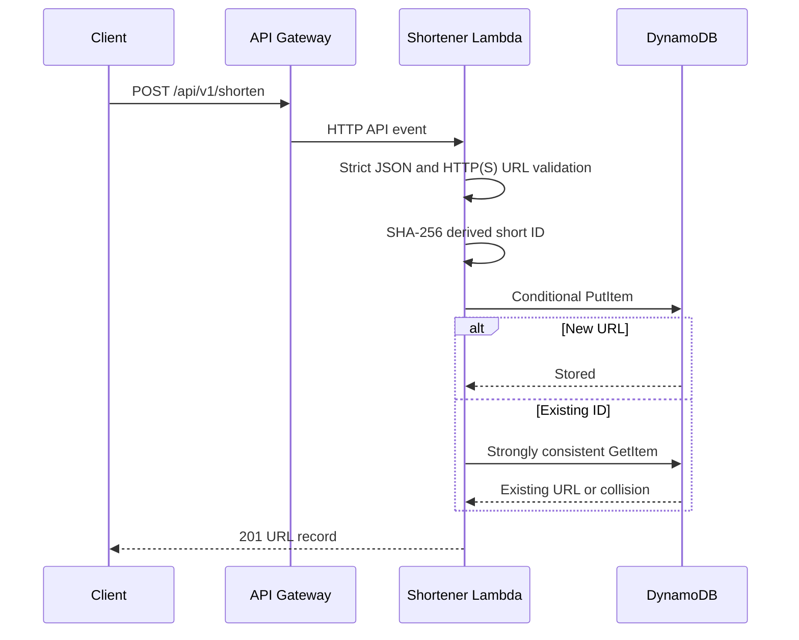

# Write path

```mermaid
sequenceDiagram
    participant C as Client
    participant G as API Gateway
    participant S as Shortener Lambda
    participant D as DynamoDB
    C->>G: POST /api/v1/shorten
    G->>S: HTTP API event
    S->>S: Strict JSON and HTTP(S) URL validation
    S->>S: SHA-256 derived short ID
    S->>D: Conditional PutItem
    alt New URL
        D-->>S: Stored
    else Existing ID
        S->>D: Strongly consistent GetItem
        D-->>S: Existing URL or collision
    end
    S-->>C: 201 URL record
```

The body is size-limited, unknown JSON fields and multiple JSON values are rejected, URL credentials are forbidden, and a conditional write prevents collision overwrites.
