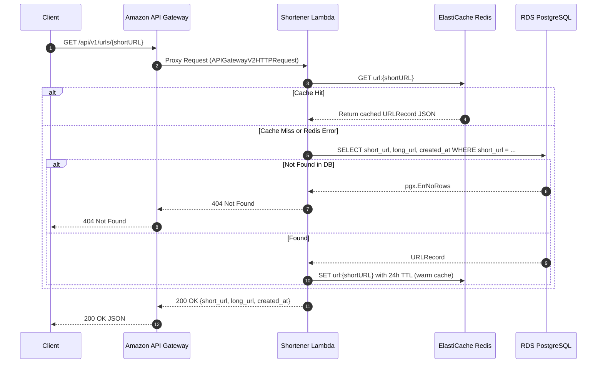
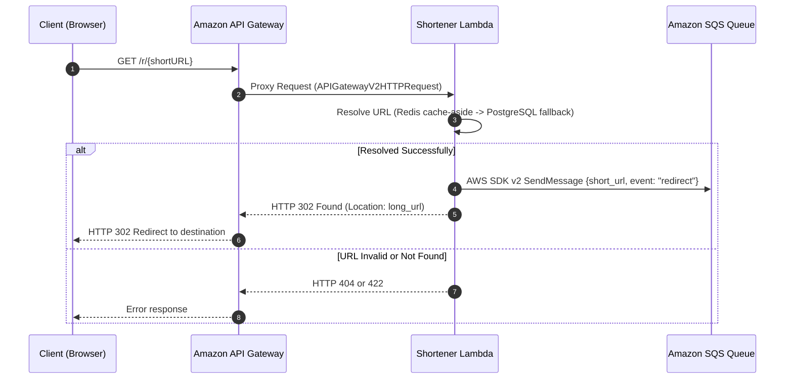

# Read Path API & Redirect Flow

This document details the read resolution and redirect workflow through Amazon API Gateway, AWS Lambda, ElastiCache Redis, and RDS PostgreSQL.

## 1. Metadata Query Flow (`GET /api/v1/urls/{shortURL}`)

---

## 2. Public Redirect Flow (`GET /r/{shortURL}`)

