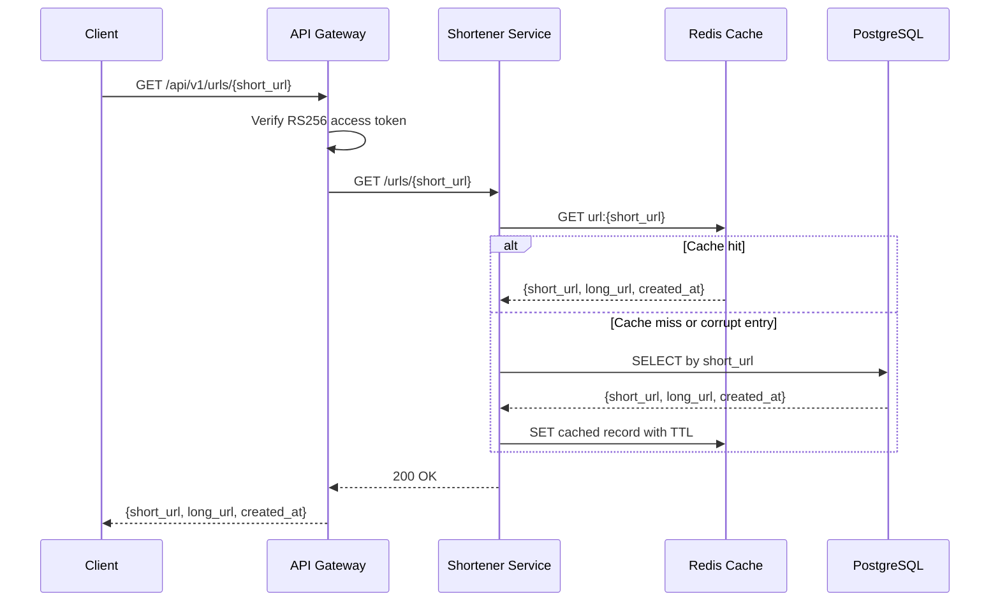

# Read Path API

```mermaid
sequenceDiagram
    participant C as Client
    participant G as API Gateway
    participant S as Shortener Service
    participant R as Redis Cache
    participant DB as PostgreSQL

    C ->> G: GET /api/v1/urls/{short_url}
    G ->> G: Verify RS256 access token
    G ->> S: GET /urls/{short_url}
    S ->> R: GET url:{short_url}
    alt Cache hit
        R -->> S: {short_url, long_url, created_at}
    else Cache miss or corrupt entry
        S ->> DB: SELECT by short_url
        DB -->> S: {short_url, long_url, created_at}
        S ->> R: SET cached record with TTL
    end
    S -->> G: 200 OK
    G -->> C: {short_url, long_url, created_at}
```
