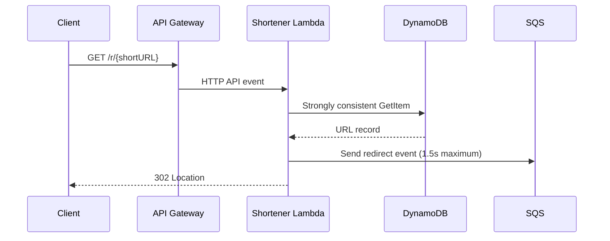

# Read and redirect paths

Invalid identifiers return 422, unknown identifiers return 404, and dependency failures return 500. Analytics enqueue failure is logged but does not prevent a valid redirect.
